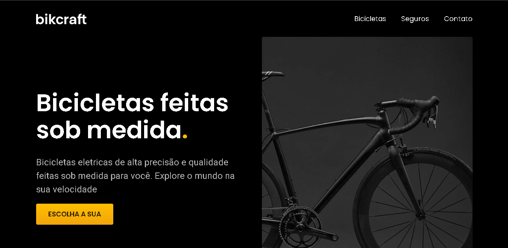

# 🚲 Bikcfraft

## Tecnologias usadas:




> Se trata de um site para uma empresa ficticia chamada "Bikcraft" onde é mostrado informações sobre a empresa e seus produtos.

Caso queira visualizar o projeto em funcionamento agora mesmo: [Clique aqui](augustoti.github.io/bikcraft/)

## 💻 Pré-requisitos:

Se você deseja clonar o projeto em sua máquina:

- Você precisa ter o editor de código `Visual Studio Code` na sua máquina.
- Você precisa está com o `git` instalado em sua máquina.
- Você presia ter a extensão `Live Server` instalado no seu editor de código.
- Você precisa ter com uma conexão com a internet.

## 🚀 Clonando o projeto

Com o `git` instalado, abra seu terminal no local onde você deseje que projeto fique e rode o seguinte comando:

```
git clone https://github.com/AugustoTI/Bikcraft.git
```

## ☕ Acessando o projeto

Com o projeto clonado, abra ele com o seu editor de código e procure o arquivo `index.html`. Clique com o botão direito no arquivo e vá na opção: `Open with Live Server`
